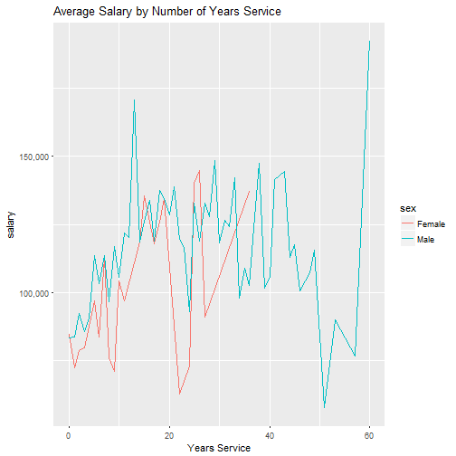

Professor Salary Shiny App
========================================================
author: Chris Rector
date: January 29, 2017
autosize: true

Overview
========================================================

As part of the Johns Hopkins Developing Data Products course, offered via Coursera, we've developed a Shiny App to allow you to visualize university professor salary data in terms of:

- the sex of the professor
- the number of years of service worked by the professor

The Data
========================================================
The data used by the Shiny App comes from the Salaries data set, which can be found in the "car" library.


```r
library(car)
str(Salaries)
```

```
'data.frame':	397 obs. of  6 variables:
 $ rank         : Factor w/ 3 levels "AsstProf","AssocProf",..: 3 3 1 3 3 2 3 3 3 3 ...
 $ discipline   : Factor w/ 2 levels "A","B": 2 2 2 2 2 2 2 2 2 2 ...
 $ yrs.since.phd: int  19 20 4 45 40 6 30 45 21 18 ...
 $ yrs.service  : int  18 16 3 39 41 6 23 45 20 18 ...
 $ sex          : Factor w/ 2 levels "Female","Male": 2 2 2 2 2 2 2 2 2 1 ...
 $ salary       : int  139750 173200 79750 115000 141500 97000 175000 147765 119250 129000 ...
```

Overview of Professor Data
========================================================

The following plot shows the average salaries for the entire data set, by sex and rank.


Features of Our Shiny App
========================================================

In addition to the bar plot shown in the previous slide, our app provides a line plot of average professor salaries at each year of service. Each plot is available in its own separate tab.




The two plots are dynamically updated based on the years of service slide and sex radio buttons shown on the left side of the application.

Where to Find the App
========================================================

Please find the app at the following url:

https://rector.shinyapps.io/ShinyApp/

We hope you enjoy it.

